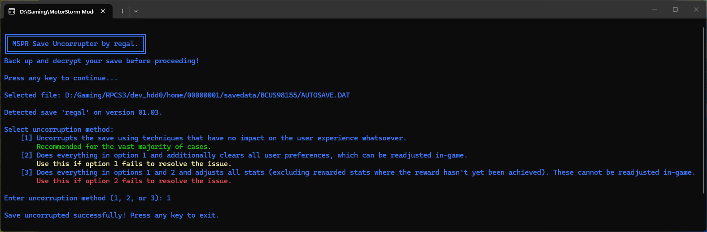

# mspr-save-uncorrupter
A simple tool that uncorrupts MotorStorm: Pacific Rift save files.

Fixes most corrupted save files including those that freeze or crash during loading screens, for example the common issue of freezing when loading a Wreckreation event.

You may also notice faster loading times in some cases.

## Screenshot


## Requirements
- Python 3.5+ (if running from source)
- AUTOSAVE.DAT from a retail MotorStorm: Pacific Rift save, (must be decrypted already)

## Usage

> ## **Important:** This tool is still a work in progress. Method 1, which handles the majority of cases, is functional, but Methods 2 and 3 are not yet fully implemented. **Always back up your save first.**

### Executable

Get the [latest MSPR_Save_Uncorrupter.exe executable](https://github.com/regallll/mspr-save-uncorrupter/releases/latest) from the Releases page and run it.

### Or, if running from source:
Clone the repository and run:
```bash
python mspr_save_uncorrupter.py
```

## Support

Either here on GitHub, or ask for help on the [MotorStorm Modding Discord server](https://discord.gg/uaGgpSazww).

## License

This project is licensed under the **[GNU Affero General Public License v3 (AGPLv3)](LICENSE)**.
